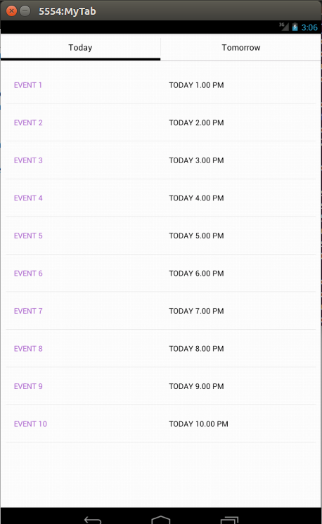
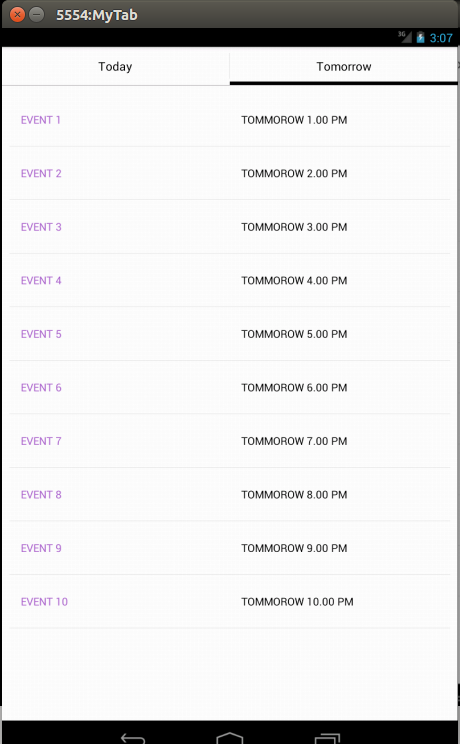

- This project shows how to use single adapter for multiple fragments having same type of data, also it shows how to create tabs using fragments.
- In this project, I took an example of showing list of events in the two tabs i.e. TODAY and TOMMOROW.
- Screenshots.

        
        
        </img>

- I used same fragment for both of the tabs i.e. EventsFragment as content of both tabs is same i.e. List of events.
- Also for showing data in the list view of Today and Tommorow fragment, I used the same adapter i.e. EventsAdapter.

- Project contains:
1. EventListActivity - Activity which contains tabs and its relative fragments using pager.
2. EventsFragment - Fragment for showing the list of events.
3. EventsAdapter - BaseAdapter which is used to show the list of events in fragments.
4. DomainClasses - Event and Datetime.
5. Xml files required.

